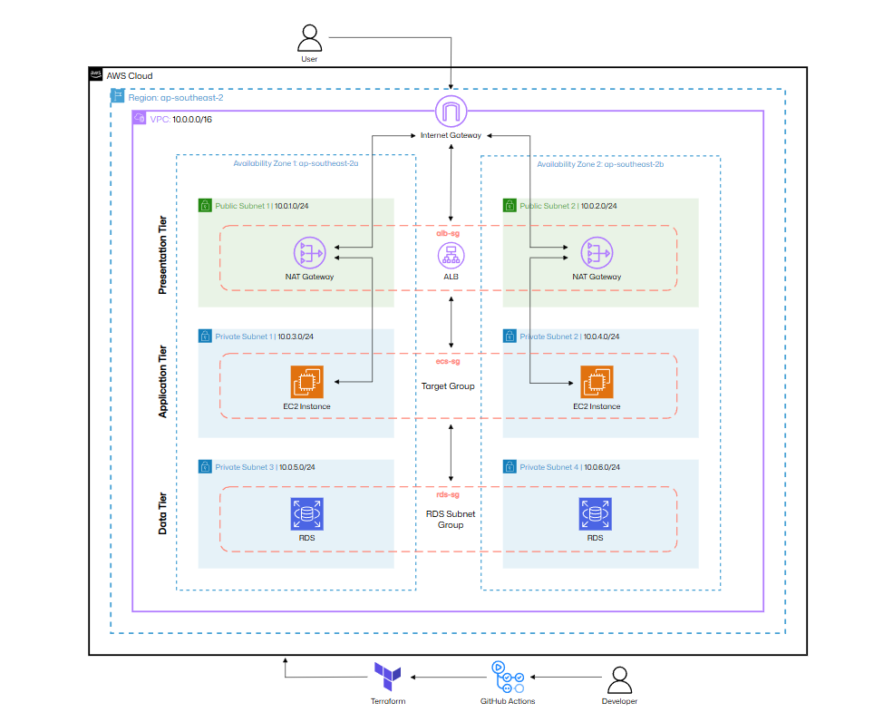

# CloudPress - 3 Tier Wordpress Deployment
<!-- Project Badges -->


<!--  -->

CloudPress is a production-style 3 tier WordPress deployment built on AWS using Terraform Infrastructure as Code

## Overview

- **Infrastructure:** Terraform with modular architecture
- **Bash Scripting:** Use user-data bash scripts to automate WordPress startup
- **Load Balancing:** Application Load Balancer for traffic management
- **Database Isolation:** Amazon RDS in private subnets
- **Security:** Private subnets, security groups, OIDC and IAM
<!-- - **CI/CD:** GitHub Actions with automated deployments -->

## Architecture Diagram



### High Level Flow

```
User searches our domain and is sent to ALB
                        ↓
ALB forwards request to EC2 Instance (private subnet)
                        ↓            
EC2 Instance sends stateful data to RDS
                        ↓            
Data is stored in RDS for persistent storage
```

### Architecture Overview

**Presentation Layer:**
- Application Load Balancer deployed across 2 public subnets
- NAT Gateway for outbound internet access from private resources

**Application Layer:**
- WordPress ec2 instances deployed in private subnets
- Instances are not publicly accessible
- Traffic only allowed from the ALB security group

**Data Layer:**
- Amazon RDS MySQL deployed in private database subnets
- Database access restricted to the application layer only


## Project Structure

```
cloudpress/
├── infra/
|   ├── .terraform.lock.hcl
|   ├── backend.tf
|   ├── main.tf
|   ├── providers.tf
|   ├── terraform.tfvars
|   ├── variables.tf
|   └── modules
|       ├── alb/
|       ├── ec2/
|       ├── networking/
|       ├── rds/
|       └── security/
|
├── scripts/
|   └── install_wordpress.sh
|
├── images/
|
└── README.md
```

## How It Works

1. Terraform provisions AWS resources (VPC, subnets, IGW)
2. An EC2 Instance is created using the latest Ubuntu AMI (dynamically via data sources)
3. A user data (cloud init) script runs on boot to:
   - Install Apache, MySQL, WordPress and PHP
   - Create a WordPress database and user
   - Set WordPress as root (replace index.html)
4. Apache is restarted and WordPress is accessible via public IP through HTTP

## Requirements

- AWS CLI
- IAM least privileges applied to your AWS user
- Terraform installed locally
- Create S3 bucket for remote backend on AWS console

## How to Deploy

### 1. Clone the Repo

```bash
git clone https://github.com/shaqealjinnah/cloudpress.git
cd infra
```

### 2. Initalise Terraform

```bash
terraform init
```

### 3. Review & Apply Infrastructure

```bash
terraform plan
terraform apply
```

### 4. Check the Live Site
After the deployment, you should see an output like:
```bash
wordpress_url = "http://16.xx.xx.xx"
```

## Live WordPress Deployment


The screenshot above shows the successfully deployed WordPress site running on an EC2 Instance provisioned entirely with Terraform.

## Future Improvements

- Add HTTPS using ALB + ACM
- Add CI pipeline for Terraform formatting and validation
- Add sticky session to ALB for persistent data

